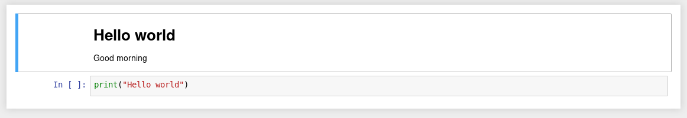
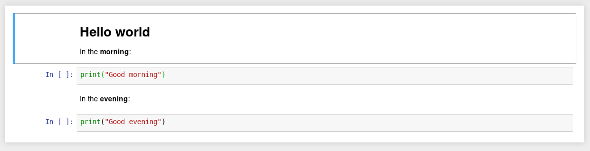

# Unpyter

I have had to work a lot with jupyter notebooks lately. Jupyter notebooks
look nice, they are saved in the reasonable json format, they are easily
shared with other people and they can be converted to a wide range of
portable formats (like html, pdf or markdown) using `jupyter nbconvert`.
When editing code in jupyter, however, I often become frustrated with
jupyter's handling. While there are various quirks, the problem usually
seems to boil down to the simple fact that my web browser just isn't
much of a text editor. What I was missing was the workflow I am used to
from working with plain python files, using my favourite text editor for
editing and a simple command prompt for testing and debugging.

`unpyter` is a simple script I wrote to allow for exactly that. When
called with the path to an `.ipynb`-file as the first argument, unpyter
will write a corresponding python file to stdout, preserving information
about the different cells in the notebook by adding special comments
like `### markdown cell ###` or `### code cell ###` wherever a new cell
begins in the notebook. The content of markdown cells will appear as
comments, so that it doesn't interfere with execution of the resulting
script. The real power of `unpyter`, however, lies in the fact that the
resulting python script (unlike, for example, the script produced by
`jupyter nbconvert` when converting to plain python) can be used to
create the exact same jupyter notebook that was used to create it in
the first place. This is achieved by invoking `unpyter` with the path to
a file with `.py` extension as the first argument. `unpyter` therefore
allows to switch back and forth between working with jupyter notebooks
and working with plain python scripts with relative ease and to use a
wide range of different tools for editing and debugging along the way.


## Usage example

Say you have a jupyter notebook called `hello.ipynb`, containing some
simple hello-world-content:

[](docs/hello.ipynb)

The corresponding source looks like this:

```json
{
 "cells": [
  {
   "cell_type": "markdown",
   "metadata": {},
   "source": [
    "# Hello world\n",
    "\n",
    "Good morning"
   ]
  },
  {
   "cell_type": "code",
   "execution_count": null,
   "metadata": {},
   "outputs": [],
   "source": [
    "print(\"Hello world\")"
   ]
  }
 ],
 "metadata": {
  "kernelspec": {
   "display_name": "Python 3",
   "language": "python",
   "name": "python3"
  },
  "language_info": {
   "codemirror_mode": {
    "name": "ipython",
    "version": 3
   },
   "file_extension": ".py",
   "mimetype": "text/x-python",
   "name": "python",
   "nbconvert_exporter": "python",
   "pygments_lexer": "ipython3",
   "version": "3.7.1"
  }
 },
 "nbformat": 4,
 "nbformat_minor": 2
}
```

Running `unpyter hello.ipynb > hello.py` on the commandline will produce
the following script:

```python
#!/usr/bin/env python3

### markdown cell ###
# # Hello world
# 
# Good morning

### code cell ###
print("Hello world")
```

Now you can run `unpyter hello.py > hello2.ipynb` to produce a second
jupyter notebook, which is exactly the same as `hello.ipynb`. Doing
`diff hello.ipynb hello2.ipynb` should (at most) detect differences
concerning the exact version of the ipython kernel referred to in the
notebook in case you use a different ipython kernel version than the
one hardcoded in `unpyter`.

The python script is easy to edit and new cells can be added by following
the `### XYZ cell ###` syntax. The following, for example, would be a
modified version that perfectly translates back to ipynb:

```python
#!/usr/bin/env python3

### markdown cell ###
# # Hello world
# 
# In the **morning**:

### code cell ###
print("Good morning")

### markdown cell ###
# In the **evening**:

### code cell ###
print("Good evening")
```




## Installing

`unpyter` is a standalone python script that only relies on standard
libraries. Adding it to the `PATH` and marking it executable should be
sufficient to make it run. (A working python interpreter has to be found
in the `PATH` as well, of course.) Renaming `unpyter.py` to `unpyter`
for use from the command prompt (as opposed to possible use as a python
library) is strongly recommended.


## Known Issues

- The notebook's metadata is currently not preserved. When converting to
  plain python, all metadata is discarded, and when converting to ipynb,
  hardcoded values are used. Should a usecase arise however, I might
  consider adding this feature.
- The output of code cells is not preserved either and there are no
  plans of adding this capacity in the future. If you need to produce
  notebooks that contain such output, you might want to pipe the resulting
  notebook through nbconvert as such:
  `unpyter filename.py | jupyter nbconvert --stdin --stdout --to notebook --execute > filename.ipynb`
